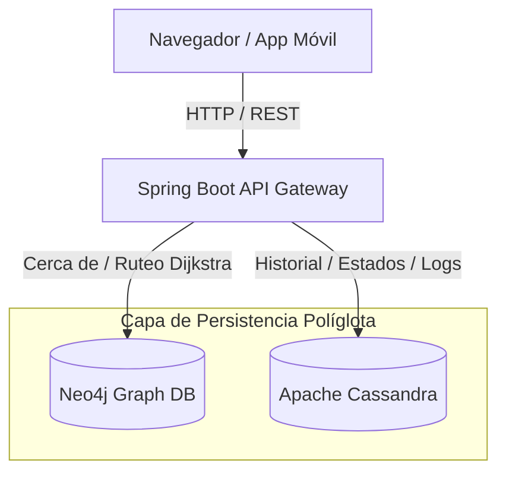

# 🚗 Smart Parking UTN - Sistema Inteligente de Gestión de Estacionamientos

[](LICENSE)
[](https://www.oracle.com/java/)
[](https://spring.io/projects/spring-boot)
[](https://react.dev/)
[](https://www.docker.com/)

**Smart Parking UTN** es una plataforma web y mobile inteligente para la optimización y gestión en tiempo real de espacios de estacionamiento. El sistema calcula recomendaciones de estacionamiento personalizadas basadas en el destino del usuario (edificios de la facultad, puertas de acceso, etc.) y calcula rutas óptimas utilizando algoritmos avanzados sobre grafos.

Este repositorio consolida toda la arquitectura del proyecto (Frontend, Backend, Móvil y Orquestación de Bases de Datos) bajo un entorno completamente Dockerizado para su despliegue inmediato con un solo comando.

---

## 🏛️ Arquitectura del Sistema y Persistencia Políglota

El núcleo más destacado de este proyecto es su enfoque de **Persistencia Políglota**, seleccionando la base de datos óptima según el caso de uso técnico, en lugar de depender de una única base de datos relacional tradicional:



### 1. 🌐 Base de Datos de Grafos (Neo4j)
Se utiliza para mapear la infraestructura física del estacionamiento:
*   **Modelo de Nodos y Relaciones:** Sectores de Estacionamiento, Edificios, Puertas de Acceso y Caminos.
*   **Caso de Uso:** Realizar búsquedas de proximidad espacial (`CERCA_DE`) y cálculo de caminos óptimos entre los puntos de acceso y las zonas de aparcamiento libre, garantizando recomendaciones precisas e instantáneas.

### 2. 📊 Base de Datos Orientada a Columnas (Apache Cassandra)
Se utiliza para la gestión del estado dinámico y series temporales:
*   **Caso de Uso:** Seguimiento en tiempo real de la ocupación de cada lugar de estacionamiento, logs de eventos de ingreso/egreso e historial de reservas/liberaciones. Su capacidad de escritura ultrarrápida y alta disponibilidad lineal la hacen perfecta para manejar la telemetría masiva de sensores.

---

## 🛠️ Stack Tecnológico

*   **Backend:** Java 21, Spring Boot 3.2.5, Spring Data Neo4j, Spring Data Cassandra.
*   **Frontend Web:** React 19, Axios, Leaflet / Force Graphs para mapeo e interfaces dinámicas.
*   **Mobile:** React Native con Expo (aplicación móvil del conductor).
*   **DevOps & Infraestructura:** Docker, Docker Compose, Nginx (servidor web del frontend), PowerShell Automation.

---

## 🚀 Inicio Rápido (Notebook / Local)

Gracias a la dockerización del ecosistema, puedes levantar todo el proyecto en tu máquina local sin tener que instalar Java, Node, Cassandra o Neo4j manualmente.

### Requisitos Previos:
1. Tener instalado [Docker Desktop](https://www.docker.com/products/docker-desktop/) en ejecución.
2. Contar con una terminal de PowerShell (por defecto en Windows).

### Despliegue en 1 comando:
1. Clona este repositorio y navega a la carpeta raíz.
2. Abre PowerShell y ejecuta nuestro script de automatización:
   ```powershell
   powershell -ExecutionPolicy Bypass -File .\setup-and-run.ps1
   ```

#### ¿Qué hace este script internamente?
1. Detecta y limpia de forma segura cualquier contenedor antiguo o huérfano para evitar colisiones de puertos.
2. Copia tus datos existentes (si los hubiera) de forma local.
3. Lanza `docker compose up -d --build` para construir y levantar los 4 contenedores en segundo plano.
4. Monitorea el proceso de arranque e indica cuándo el sistema está 100% operativo.

---

## 🎯 Servicios y Consolas Disponibles

Una vez que el script finalice, podrás acceder a los siguientes servicios en tu notebook:

*   **💻 Aplicación Web (Frontend):** [http://localhost:3000](http://localhost:3000)
*   **☕ API REST (Backend):** [http://localhost:8080/api](http://localhost:8080/api)
*   **🔍 Consola del Administrador de Neo4j:** [http://localhost:7474](http://localhost:7474)  
    *(Credenciales por defecto: Usuario `neo4j` / Contraseña `password123`)*

Para apagar la aplicación y liberar recursos cuando termines de utilizarla:
```bash
docker compose down
```

---

## 🤝 Créditos y Colaboradores

Este proyecto fue desarrollado de forma colaborativa como parte del desarrollo integrador de la cátedra de Ingeniería en Sistemas de Información.


**Integrantes del Grupo 1W3** - *Colaboración en testing, arquitectura inicial e implementación de lógica móvil.*

---

## 📄 Licencia

Este proyecto es de código abierto bajo la Licencia MIT. Siéntete libre de forkearlo, mejorarlo o usarlo como base para tus propios proyectos.
